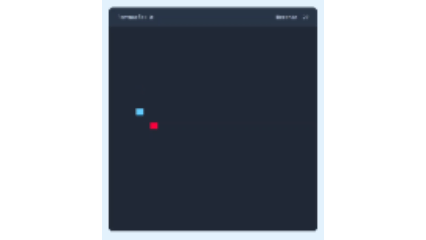

# 🐍 Snake — Eventos em JavaScript

Este projeto implementa uma versão simples do clássico **Jogo da Cobrinha (Snake)** utilizando **HTML, CSS e JavaScript**.

Mais do que construir um jogo, este repositório foi pensado como um **material de apoio para o estudo de eventos em JavaScript**, especialmente no contexto do desenvolvimento de jogos digitais.

A ideia é observar como o programa reage a diferentes acontecimentos: o jogador pressiona uma tecla, clica em um botão, o tempo passa e o estado do jogo precisa ser atualizado.

---

<p align="center">
  
</p>

---

## 🎮 Sobre o jogo

O jogador controla uma cobra em um tabuleiro de 30 × 30 posições.

O objetivo é:

* movimentar a cobra;
* coletar a comida;
* aumentar a pontuação;
* aumentar o tamanho da cobra;
* evitar as paredes;
* evitar colidir com o próprio corpo.

O jogo possui também um sistema simples de recorde, armazenado no `localStorage` do navegador.

A interface apresenta:

* pontuação atual;
* recorde;
* tabuleiro;
* controles direcionais.

Os controles podem ser realizados tanto pelo **teclado** quanto pelos **botões da interface**.

---

## 📚 Objeto de conhecimento: Eventos

### O que é um evento?

Em programação, um **evento** representa algo que aconteceu e que pode ser percebido pelo programa.

Em uma aplicação comum, alguns exemplos são:

* o usuário clicar em um botão;
* pressionar uma tecla;
* mover o mouse;
* enviar um formulário;
* uma página terminar de carregar.

Em um jogo, eventos são especialmente importantes porque permitem que o programa **reaja às ações do jogador**.

Podemos pensar em um evento como:

> **Acontecimento → programa percebe → função é executada → estado do jogo é alterado**

No Snake, por exemplo:

```text
Jogador pressiona ↑
        ↓
evento "keydown"
        ↓
mudarDirecao()
        ↓
velocidadeY = -1
        ↓
cobra passa a se movimentar para cima
```

---

# 🎯 Eventos presentes neste projeto

O projeto utiliza diferentes mecanismos relacionados a eventos.

## 1. Evento de teclado — `keydown`

Uma das principais formas de interação com o jogo acontece por meio do teclado.

No final do `script.js`, encontramos:

```javascript
document.addEventListener("keydown", mudarDirecao);
```

Aqui temos três elementos importantes:

```javascript
document
```

É o objeto que representa o documento HTML.

```javascript
"keydown"
```

É o tipo de evento que queremos observar.

```javascript
mudarDirecao
```

É a função que será executada quando o evento acontecer.

Podemos interpretar a instrução como:

> "Quando uma tecla for pressionada, execute a função `mudarDirecao`."

---

## 2. O objeto `event`

A função `mudarDirecao` recebe um parâmetro:

```javascript
function mudarDirecao(e) {
```

Esse `e` representa o **objeto do evento**.

O navegador fornece diversas informações sobre o acontecimento.

Neste projeto, uma das informações utilizadas é:

```javascript
e.key
```

Ela permite descobrir qual tecla foi pressionada.

Por exemplo:

```javascript
if(e.key === "ArrowUp") {
    ...
}
```

Isso significa:

> Se a tecla pressionada for a seta para cima, faça alguma coisa.

Da mesma forma:

```javascript
e.key === "ArrowDown"
e.key === "ArrowLeft"
e.key === "ArrowRight"
```

permitem identificar as quatro direções utilizadas pelo jogo.

---

# 🧠 Eventos e tomada de decisão

Um ponto interessante para observar é que **o evento não movimenta diretamente a cobra**.

O evento apenas informa ao jogo uma intenção do jogador:

```text
"Quero ir para cima."
```

A função transforma essa intenção em uma alteração no estado:

```javascript
velocidadeX = 0;
velocidadeY = -1;
```

Depois, durante a atualização do jogo, esses valores são utilizados para efetivamente modificar a posição:

```javascript
cobraX += velocidadeX;
cobraY += velocidadeY;
```

Essa separação é muito importante em jogos digitais.

Podemos representar o processo assim:

```text
ENTRADA DO JOGADOR
       │
       ▼
     EVENTO
       │
       ▼
  mudarDirecao()
       │
       ▼
ESTADO DO JOGO
(velocidadeX/Y)
       │
       ▼
ATUALIZAÇÃO
       │
       ▼
POSIÇÃO DA COBRA
       │
       ▼
    RENDERIZAÇÃO
```

---

# 🖱️ 3. Eventos de clique

O jogo também possui controles visuais.

No HTML existem quatro elementos:

```html
<i data-key="ArrowLeft"></i>
<i data-key="ArrowDown"></i>
<i data-key="ArrowUp"></i>
<i data-key="ArrowRight"></i>
```

Cada botão possui um atributo `data-key` que identifica a direção correspondente.

No JavaScript, esses elementos são encontrados através de:

```javascript
const controles = document.querySelectorAll(".controles i");
```

Depois, cada controle recebe um listener:

```javascript
controles.forEach(key => {
    key.addEventListener("click", () => 
        mudarDirecao({ key: key.dataset.key })
    );
});
```

Aqui aparece novamente o conceito de evento.

Desta vez:

```javascript
"click"
```

significa:

> "Quando o usuário clicar neste elemento..."

Então a função `mudarDirecao()` é chamada.

---

# 🔄 Teclado e botão utilizando a mesma lógica

Um detalhe didaticamente interessante deste projeto é que **duas formas diferentes de entrada chegam à mesma função**.

### Teclado

```javascript
document.addEventListener("keydown", mudarDirecao);
```

### Botão

```javascript
key.addEventListener("click", () => 
    mudarDirecao({ key: key.dataset.key })
);
```

Apesar de serem eventos diferentes, ambos acabam chamando:

```javascript
mudarDirecao(...)
```

Isso evita duplicar a lógica do movimento.

Podemos representar:

```text
              ┌─── teclado ───► keydown ───┐
              │                              │
JOGADOR ──────┤                              ├──► mudarDirecao()
              │                              │
              └─── botão ─────► click ──────┘
```

Esse é um excelente exemplo para discutir com os alunos o princípio:

> **Diferentes entradas podem compartilhar a mesma regra de negócio.**

---

# ⏱️ 4. O tempo também participa do jogo

Além dos eventos produzidos pelo jogador, o jogo precisa continuar sendo atualizado mesmo quando o jogador não está fazendo nada.

Para isso, o projeto utiliza:

```javascript
setInterval(iniciar, 125);
```

Isso faz com que a função `iniciar()` seja executada aproximadamente a cada **125 milissegundos**.

Podemos pensar nesse mecanismo como o "relógio" do jogo:

```text
125 ms
  ↓
iniciar()
  ↓
atualiza posição
  ↓
verifica colisões
  ↓
desenha novamente
  ↓
125 ms
  ↓
iniciar()
  ↓
...
```

Esse mecanismo é fundamental para produzir a sensação de movimento.

### Uma observação importante

`setInterval` não é exatamente um "evento de jogador".

Ele é um mecanismo de **agendamento de execução**.

Essa diferença é interessante para os alunos:

| Situação                     | Mecanismo     |
| ---------------------------- | ------------- |
| Jogador aperta uma tecla     | `keydown`     |
| Jogador clica em um controle | `click`       |
| Jogo atualiza periodicamente | `setInterval` |

---

# 🐍 5. O estado do jogo

Para compreender os eventos, também precisamos entender o **estado** que eles modificam.

O projeto mantém diversas variáveis:

```javascript
let gameOver = false;

let comidaX, comidaY;

let cobraX = 5, cobraY = 10;

let corpoCobra = [];

let velocidadeX = 0, velocidadeY = 0;

let pontuacao = 0;
```

Essas variáveis representam informações que mudam durante a execução.

Por exemplo:

```javascript
velocidadeX
velocidadeY
```

representam a direção atual da cobra.

Quando o jogador pressiona uma tecla, o evento modifica essas informações.

Depois, `iniciar()` utiliza essas informações para atualizar o jogo.

---

# 🍎 6. Eventos e regras do jogo

Os eventos não servem apenas para movimentar a cobra.

O próprio ciclo de atualização verifica acontecimentos importantes.

Por exemplo:

```javascript
if(cobraX === comidaX && cobraY === comidaY) {
```

Aqui o programa verifica se a cobra chegou à comida.

Quando isso acontece:

```javascript
corpoCobra.push([comidaX, comidaY]);
pontuacao++;
```

A cobra cresce e a pontuação aumenta.

Outro acontecimento importante é a colisão com as paredes:

```javascript
if(cobraX <= 0 || cobraX > 30 || 
   cobraY <= 0 || cobraY > 30) {
    gameOver = true;
}
```

E existe também a verificação de colisão da cabeça com o próprio corpo.

Esses exemplos ajudam a ampliar a ideia de evento:

> Nem todo acontecimento relevante em um jogo precisa ser uma ação direta do jogador.

---

# 💾 7. `localStorage` e o recorde

O projeto também utiliza o armazenamento local do navegador:

```javascript
localStorage.getItem("pontuacao-recorde")
```

e:

```javascript
localStorage.setItem(
    "pontuacao-recorde",
    pontucaoRecorde
);
```

Dessa maneira, o recorde pode permanecer salvo mesmo depois que a página é recarregada.

Esse trecho permite introduzir outro conceito importante:

**eventos e estado persistente.**

O jogador realiza ações → o estado muda → o jogo verifica a pontuação → o recorde pode ser atualizado → o navegador armazena o novo valor.

---

# 🧩 Estrutura do projeto

O repositório possui três arquivos principais:

```text
snake/
├── index.html
├── script.js
└── style.css
```

### `index.html`

Define a estrutura da interface:

* pontuação;
* recorde;
* tabuleiro;
* controles;
* carregamento do JavaScript.

O JavaScript é carregado com:

```html
<script src="script.js" defer></script>
```

### `style.css`

É responsável pela apresentação visual do jogo.

### `script.js`

Contém a lógica principal:

* estado do jogo;
* movimentação;
* geração da comida;
* crescimento da cobra;
* colisões;
* pontuação;
* recorde;
* eventos de teclado;
* eventos de clique;
* atualização periódica do jogo.

---

# 🔍 Para estudar: siga o caminho dos eventos

Uma boa estratégia para estudar este projeto é não tentar entender todo o código de uma vez.

Comece pelos eventos.

### 1. Localize:

```javascript
document.addEventListener("keydown", mudarDirecao);
```

Pergunte:

**O que acontece quando o usuário pressiona uma tecla?**

---

### 2. Entre na função:

```javascript
function mudarDirecao(e) {
```

Observe:

```javascript
e.key
```

Pergunte:

**Como o programa descobre qual tecla foi pressionada?**

---

### 3. Observe a alteração do estado:

```javascript
velocidadeX = ...
velocidadeY = ...
```

Pergunte:

**O evento movimentou a cobra ou apenas alterou uma informação que será utilizada depois?**

---

### 4. Localize:

```javascript
setInterval(iniciar, 125);
```

Pergunte:

**Quem realmente atualiza a posição da cobra?**

---

### 5. Entre em:

```javascript
function iniciar() {
```

Acompanhe:

```text
verificar comida
      ↓
mover corpo
      ↓
mover cabeça
      ↓
verificar paredes
      ↓
verificar corpo
      ↓
renderizar
```

Essa sequência permite compreender a relação entre **entrada → estado → atualização → resultado visual**.

---

# 🧪 Atividades sugeridas

## Atividade 1 — Criando um novo evento

Adicione um evento para detectar a tecla `Space`.

Quando o jogador pressionar espaço, exiba uma mensagem no console:

```javascript
console.log("Espaço pressionado!");
```

---

## Atividade 2 — Evento de clique

Adicione um botão:

```html
<button id="botaoTeste">
    Testar evento
</button>
```

Depois, faça com que o clique produza uma mensagem:

```javascript
document
    .querySelector("#botaoTeste")
    .addEventListener("click", () => {
        console.log("Botão clicado!");
    });
```

Observe a estrutura:

```text
elemento
   ↓
addEventListener
   ↓
tipo do evento
   ↓
função
```

---

## Atividade 3 — Alterando a velocidade

Investigue:

```javascript
setInterval(iniciar, 125);
```

Teste outros valores:

```javascript
setInterval(iniciar, 200);
```

e:

```javascript
setInterval(iniciar, 75);
```

O que acontece com a experiência de jogo?

> Quanto menor o intervalo, mais frequentemente a função será executada.

---

## Atividade 4 — Criando um evento de pausa

Crie uma variável:

```javascript
let pausado = false;
```

Faça com que a tecla `Space` alterne entre:

```text
jogo rodando
       ↕
jogo pausado
```

Uma possibilidade é fazer a função `iniciar()` verificar o estado:

```javascript
if (pausado) return;
```

Essa atividade é interessante porque mostra que um evento pode **alterar o estado**, enquanto outra parte do programa utiliza esse estado para determinar o comportamento do jogo.

---

# 💡 Perguntas para discussão

Durante a análise do código, tente responder:

1. O que é um evento?
2. Qual é a diferença entre `keydown` e `click`?
3. O que é o objeto `event`?
4. Para que serve `event.key`?
5. O que faz `addEventListener()`?
6. Por que `mudarDirecao()` recebe um parâmetro?
7. Por que teclado e controles na tela podem utilizar a mesma função?
8. Qual é a função do `setInterval()` neste jogo?
9. O `setInterval()` é igual a um evento de teclado?
10. O que acontece com o estado do jogo depois de um evento?
11. Por que separar a entrada do jogador da atualização da posição da cobra?
12. O que aconteceria se removêssemos:

```javascript
document.addEventListener("keydown", mudarDirecao);
```

13. O que aconteceria se removêssemos:

```javascript
setInterval(iniciar, 125);
```

---

# 🎓 Objetivos de aprendizagem

Ao analisar e modificar este projeto, espera-se que o estudante seja capaz de:

* compreender o conceito de **evento**;
* identificar eventos de interação do usuário;
* utilizar `addEventListener()`;
* compreender o objeto `event`;
* utilizar propriedades como `event.key`;
* associar eventos a funções;
* diferenciar eventos de entrada e mecanismos de atualização;
* compreender a relação entre **evento, estado e comportamento**;
* utilizar eventos de teclado e mouse;
* aplicar eventos em um contexto de desenvolvimento de jogos digitais;
* modificar um projeto existente para criar novos comportamentos.

---

# 🧠 Uma ideia central para levar da atividade

No desenvolvimento de jogos, podemos pensar em uma estrutura básica:

```text
             ┌──────────────────┐
             │     ENTRADAS     │
             │                  │
             │ teclado / mouse  │
             │ controle / toque │
             └────────┬─────────┘
                      │
                      ▼
             ┌──────────────────┐
             │     EVENTOS      │
             └────────┬─────────┘
                      │
                      ▼
             ┌──────────────────┐
             │      ESTADO      │
             │                  │
             │ posição          │
             │ direção          │
             │ pontuação        │
             │ game over        │
             └────────┬─────────┘
                      │
                      ▼
             ┌──────────────────┐
             │    ATUALIZAÇÃO   │
             │                  │
             │ regras do jogo   │
             │ colisões         │
             │ movimento        │
             └────────┬─────────┘
                      │
                      ▼
             ┌──────────────────┐
             │   RENDERIZAÇÃO   │
             │                  │
             │ tela do jogo     │
             └──────────────────┘
```

O Snake é um projeto pequeno, mas permite visualizar um dos fundamentos da programação de jogos:

> **O jogo recebe entradas, reage a eventos, modifica seu estado, atualiza suas regras e apresenta um novo resultado na tela.**

A partir desse modelo, é possível evoluir para projetos cada vez mais complexos, adicionando novos tipos de entrada, personagens, inimigos, colisões, sons, menus, pontuação e diferentes estados de jogo.

---

## 🚀 Próximos passos

Depois de compreender os eventos presentes neste projeto, experimente evoluí-lo:

* adicionar pausa;
* adicionar botão de reinício sem recarregar a página;
* adicionar efeitos sonoros;
* adicionar diferentes tipos de comida;
* criar níveis de dificuldade;
* adicionar suporte a controle/gamepad;
* criar novos estados, como `menu`, `jogando`, `pausado` e `game over`;
* substituir `setInterval()` por uma arquitetura baseada em `requestAnimationFrame()`;
* separar o código em módulos;
* criar uma fila de comandos para tratar múltiplas entradas do jogador.

Cada melhoria pode ser utilizada como uma nova oportunidade para estudar **eventos, estado e arquitetura de jogos**.
